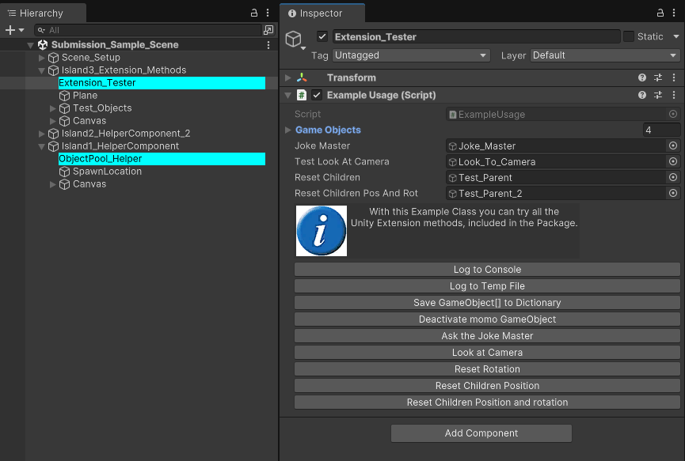

# Depths of Unity 24/25
## Linus Ziesel, 1st part of submission

*Sample Scene: Here all methods can be tested with button clicks.*

## ExtensionMethods Class 

This class contains various extension methods for Unity objects and components. Here's a breakdown of each method:

### GameObject Array Extensions

- **ArrayToDict** - Converts an array of GameObjects into a Dictionary, using the GameObject names as keys.

### Transform Extensions

- **LookAtCamera** - Makes the transform look at the main camera.
- **ResetRotation** - Resets the transform's rotation to identity (no rotation).
- **ResetChildrenTransform** - Resets the local position of all child objects to zero. If specified, also resets their rotation.
- **LookAtY** - Rotates the transform to look at a target position, but only on the Y-axis.

### GameObject Extensions

- **LogInfo** - Logs the GameObject's name, position, and active state to the console.
- **PrintJoke** - Fetches a random Chuck Norris joke from an API and logs it to the console.
- **GetOrAddComponent<T>** - Gets a component of type T from the GameObject, or adds it if it doesn't exist.

### General Object Extensions

- **Log** - Logs any object to the Unity console.
- **WriteToTempFile** - Writes an object's string representation to a temporary file.

## Helper Components

### ObjectPoolComponent
A component that creates an object pool for a given GameObject.

#### Functions:

- **InitPool()**: Initializes the object pool with the specified size and object type.
- **SpawnObject()**: Retrieves an object from the pool and spawns it at the designated location.
- **ClearPool()**: Removes all objects from the pool and destroys them.

## ParentingHelper
A component that parents nearby objects to its transform.

#### Functions:

- **CatchChildren()**: Finds all objects with colliders within a specified radius and makes them children of this transform.
- **CatchChildrenNonAlloc()**: A non-allocating version of CatchChildren that limits the number of objects that can be parented.

## UI Helpers

- Hierarchy Highlight
- Info Box, with icon
- Inspector Buttons
